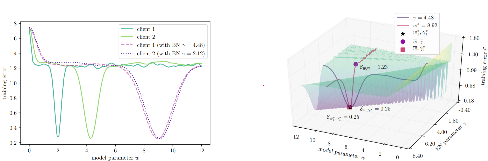

# FedBN: Federated Learning on Non-IID Features via Local Batch Normalization
This is the PyTorch implemention of our paper **[FedBN: Federated Learning on Non-IID Features via Local Batch Normalization](https://openreview.net/pdf?id=6YEQUn0QICG)** by [Xiaoxiao Li](https://xxlya.github.io/xiaoxiao/), [Meirui Jiang](https://meiruijiang.github.io/MeiruiJiang/), Xiaofei Zhang, [Michael Kamp](https://michaelkamp.org/) and [Qi Dou](http://www.cse.cuhk.edu.hk/~qdou/)
## Abstract
> The emerging paradigm of federated learning (FL) strives to enable collaborative training of deep models on the network edge without centrally aggregating raw data and hence improving data privacy. In most cases, the assumption of independent and identically distributed samples across local clients does not hold for federated learning setups. Under this setting, neural network training performance may vary significantly according to the data distribution and even hurt training convergence. 
Most of the previous work has focused on a difference in the distribution of labels. Unlike those settings, we address an important problem of FL, e.g., different scanner/sensors in medical imaging, different scenery distribution in autonomous driving (highway vs. city), where local clients may store examples with different marginal or conditional feature distributions compared to other nodes, which we denote as feature shift non-iid.  In this work, we propose an effective method that uses local batch normalization to alleviate the feature shift before averaging models. The resulting scheme, called FedBN, outperforms both classical FedAvg, as well as the state-of-the-art for non-iid data (FedProx) on our extensive experiments. These empirical results are supported by a convergence analysis that shows in a simplified setting that FedBN has a faster convergence rate in expectation than FedAvg.


## Usage
### Setup
**pip**

See the `requirements.txt` for environment configuration. 
```bash
pip install -r requirements.txt
```
**conda**

We recommend using conda to quick setup the environment. Please use the following commands.
```bash
conda env create -f environment.yaml
conda activate fedbn
```
### Dataset & Pretrained Modeel
**Benchmark(Digits)**
- Please download our pre-processed datasets [here](https://huggingface.co/datasets/Jemary/FedBN_Dataset/blob/main/digit_model.zip), put under `data/` directory and perform following commands:
    ```bash
    cd ./data
    unzip digit_dataset.zip
    ```
- Please download our pretrained model [here](https://huggingface.co/datasets/Jemary/FedBN_Dataset/blob/main/digit_dataset.zip) and put under `snapshots/` directory, perform following commands:
    ```bash
    cd ./snapshots
    unzip digit_model.zip
    ```
    
**office-caltech10**
- Please download our pre-processed datasets [here](https://huggingface.co/datasets/Jemary/FedBN_Dataset/blob/main/office_caltech_10_dataset.zip), put under `data/` directory and perform following commands:
    ```bash
    cd ./data
    unzip office_caltech_10_dataset.zip
    ```
- Please download our pretrained model [here](https://huggingface.co/datasets/Jemary/FedBN_Dataset/blob/main/office_caltech_10_model.zip) and put under `snapshots/` directory, perform following commands:
    ```bash
    cd ./snapshots
    unzip office_caltech_10_model.zip
    ```
**DomainNet**
- Please first download our splition [here](https://huggingface.co/datasets/Jemary/FedBN_Dataset/blob/main/domainnet_dataset.zip), put under `data/` directory and perform following commands:
    ```bash
    cd ./data
    unzip domainnet_dataset.zip
    ```
- then download dataset including: [Clipart](http://csr.bu.edu/ftp/visda/2019/multi-source/clipart.zip), [Infograph](http://csr.bu.edu/ftp/visda/2019/multi-source/infograph.zip), [Painting](http://csr.bu.edu/ftp/visda/2019/multi-source/painting.zip), [Quickdraw](http://csr.bu.edu/ftp/visda/2019/multi-source/quickdraw.zip), [Real](http://csr.bu.edu/ftp/visda/2019/multi-source/real.zip), [Sketch](http://csr.bu.edu/ftp/visda/2019/multi-source/sketch.zip), put under `data/DomainNet` directory and unzip them.
    ```bash
    cd ./data/DomainNet
    unzip [filename].zip
    ```
- Please download our pretrained model [here](https://huggingface.co/datasets/Jemary/FedBN_Dataset/blob/main/domainnet_model.zip) and put under `snapshots/` directory, perform following commands:
    ```bash
    cd ./snapshots
    unzip domainnet_model.zip
    ```

### Train
Federated Learning

Please using following commands to train a model with federated learning strategy.
- **--mode** specify federated learning strategy, option: fedavg | fedprox | fedbn 
```bash
cd federated
# benchmark experiment
python fed_digits.py --mode fedbn

# office-caltech-10 experiment
python fed_office.py --mode fedbn

# DomaiNnet experiment
python fed_domainnet.py --mode fedbn
```
SingleSet

Please using following commands to train a model using singleset data.
- **--data** specify the single dataset
```bash
cd singleset 
# benchmark experiment, --data option: svhn | usps | synth | mnistm | mnist
python single_digits.py --data svhn

# office-caltech-10 experiment --data option: amazon | caltech | dslr | webcam
python single_office.py --data amazon

# DomaiNnet experiment --data option: clipart | infograph | painting | quickdraw | real | sketch
python single_domainnet.py --data clipart
```

### Test

```bash
cd federated
# benchmark experiment
python fed_digits.py --mode fedbn --test

# office-caltech-10 experiment
python fed_office.py --mode fedbn --test

# DomaiNnet experiment
python fed_domainnet.py --mode fedbn --test
```

## Citation
If you find the code and dataset useful, please cite our paper.
```latex
@inproceedings{
li2021fedbn,
title={Fed{\{}BN{\}}: Federated Learning on Non-{\{}IID{\}} Features via Local Batch Normalization},
author={Xiaoxiao Li and Meirui Jiang and Xiaofei Zhang and Michael Kamp and Qi Dou},
booktitle={International Conference on Learning Representations},
year={2021},
url={https://openreview.net/pdf?id=6YEQUn0QICG}
}
```
